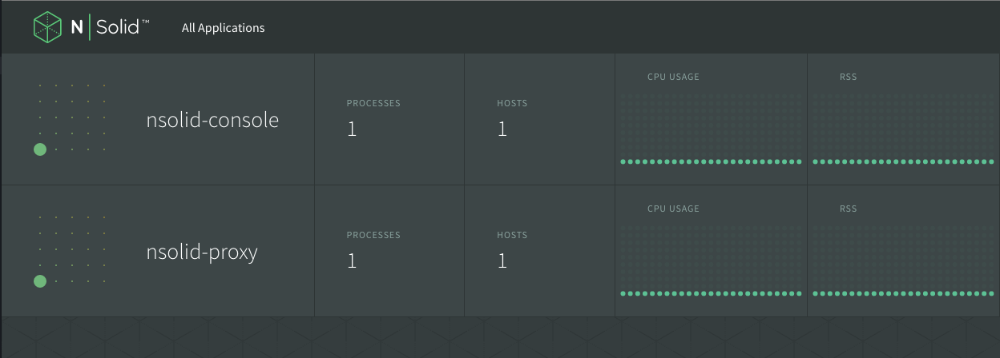

## Setup

* Make sure Docker is installed
* Create a [Google Cloud](https://cloud.google.com/) account. (You can sign up for a free trial)
* Create a Project in Google Cloud Dashboard.

### Installing gcloud command line utilities

```bash
  # install gcloud
  curl https://sdk.cloud.google.com | bash
  # Restart shell
  exec -l $SHELL
  gcloud components install kubectl
  gcloud --quiet components update
```

### Setup gcloud defaults

```bash
gcloud auth login
gcloud config set project <PROJECT_ID>
gcloud config set compute/zone <ZONE>
```

* Your `PROJECT_ID` can be found in your dashboard
* A Cluster is deployed to a single zone. You can find [more about zones here](https://cloud.google.com/compute/docs/zones?hl=en). Or you can select one from the list generated from `gcloud compute zones list`

## Create a Cluster

```bash
gcloud container clusters create nsolid-cluster \
 --username admin \
 --password password \
 --num-nodes 3 \
 --machine-type n1-standard-1 \
 --disk-size 80 \
 --enable-cloud-logging \
 --enable-cloud-monitoring \
 --scope "https://www.googleapis.com/auth/devstorage.read_write" \
 --wait
 ```

* Username & Password flags are for accessing your kubernetes cluster
* Enable cloud logging & monitoring flags only work if you have enabled them in the dashboard. Logging requires creating a bucket to dump log files to.
* Scope: Allows your instances to have oauth access to particular parts of the cloud api. In this case `devstorage.read_write` allows access to buckets.
* `wait` blocks the command until cluster and instances are ready. This could take 3-5 minutes.

If you omit the `password` flag google will create one for you. After your cluster is setup you can find it by

```bash
gcloud container clusters describe nsolid-cluster | grep password
```

### Set cluster as default

```bash
  gcloud config set container/cluster nsolid-cluster
  # share credentials with kubectl
  gcloud container clusters get-credentials nsolid-cluster
```

### Accessing your Kubernetes dashboard

```bash
kubectl cluster-info
```
The master url will provide you with a list of resource like the ui, swagger, logs, metrics, health, and api.

## Deployment

**WARNING**: The configuration exposes `nsolid-console` on a public ip address. This is for the purpose of the demo. It is remommended that you understand how to configure [GCE network](https://cloud.google.com/compute/docs/networking) for your needs.

### Services

```bash
kubectl create -f registry-service.yaml
kubectl create -f proxy-service.yaml
kubectl create -f console-service.yaml
```

* Note: console-service gets assigned a public ip address (provided by a Google Load Balancer) which usually takes 1-2 minutes to provision.  Once created, you can get find this public ip under 'EXTERNAL_IP' when you run
```bash
$ kubectl get svc
```

For example, here's the N|Solid services running in our demo cluster:
```
NAME              CLUSTER_IP     EXTERNAL_IP       PORT(S)    SELECTOR             AGE
kubernetes        10.67.240.1    <none>            443/TCP    <none>               18m
nsolid-console    10.67.240.14   104.196.117.135   80/TCP     app=nsolid-console   4m
nsolid-proxy      10.67.247.16   <none>            9000/TCP   app=nsolid-proxy     4m
nsolid-registry   10.67.254.76   <none>            4001/TCP   app=nsolid-etcd      4m
```


### Replication Controller / Pods

```bash
$ kubectl create -f etcd-controller.yaml
$ kubectl create -f proxy-controller.yaml
$ kubectl create -f console-controller.yaml
```

We can check that the N|Solid services are up by running:
```bash
$ kubectl get pods
```

For example, here are the three N|Solid pods running in our demo cluster:

```
NAME                   READY     STATUS    RESTARTS   AGE
nsolid-console-r43b7   1/1       Running   0          43s
nsolid-etcd-xw0cz      1/1       Running   0          57s
nsolid-proxy-ua00q     1/1       Running   0          49s
```

At this point, you can verify that N|Solid is running properly by opening
your web browser to the public ip address that the console service creates.

You should see the N|Solid console which should look like this:


## Deploying your App with N|Solid

### Dockerize Application

#### Example `Dockerfile`

```
FROM nodesource/nsolid:latest

RUN mkdir -p /usr/src/app

WORKDIR /usr/src/app

ADD server.js /usr/src/app/server.js

ENTRYPOINT ["nsolid", "server.js"]
```

#### Build Docker Image

```bash
docker build -t namespace/myapp:v1 .
```

Push image to a registry.

```bash
docker push namespace/myapp:v1
```

### Create Kubernete config files

`myapp-service.yaml`

```yaml
apiVersion: v1
kind: Service
metadata:
  name: myapp
spec:
  type: LoadBalancer
  ports:
    - port: 80
      targetPort: myapp
  selector:
    app: myapp
```

This tells kubernetes to create an external ip address and route all traffic on port 80 to the `myapp` targetPort. It will route to all pods that match the selector `app: myapp`.


`myapp-controller.yaml`

```yaml
apiVersion: v1
kind: ReplicationController
metadata:
  name: myapp
  labels:
    app: myapp
spec:
  replicas: 1
  selector:
    app: myapp
  template:
    metadata:
      labels:
        app: myapp
    spec:
      containers:
        - name: myapp
          image: namespace/myapp:v1
          env:
            - name: NSOLID_APPNAME
              value: myapp
            - name: NSOLID_HUB
              value: "registry:4001"
            - name: NSOLID_SOCKET
              value: "8000"
            - name: PORT
              value: "4444"
          ports:
            - containerPort: 4444
              name: myapp
            - containerPort: 8000
              name: nsolid
```

### Deploy

```bash
$ kubectl create -f myapp-service.yaml
$ kubectl create -f myapp-controller.yaml
```

We can check `kubectl get svc` to find out the external ip address. This is an async operation an may take a minute to full resolve and assign.

`myapp` Should display with the N|Solid console.


### Scaling

Currently only one instance of `myapp` is running. We can increase the number of replicas and the service will automatically load balance. N|Solid will automatically show an increase number of instances as well.

```bash
$ kubectl scale rc myapp --replicas=4
```
