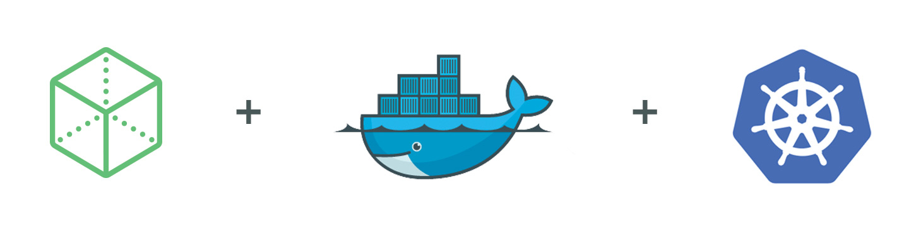

## Overview

This repository is for deploying [N|Solid](https://nodesource.com/products/nsolid) with [Kubernetes](http://kubernetes.io/). It assumes that Kubernetes is already setup for your environment.

### Table of Contents
- [Installing kubernetes](#a1)
- [Quickstart](#a2)
    - [Access N|Solid Dashboard](#a3)
    - [Uninstall N|Solid](#a4)
- [Deploying your App with N|Solid](#a5)
- [Production Install](#a6)
    - [N|Solid namespace](#a7)
    - [nginx SSL certificates](#a8)
    - [Basic Auth file](#a9)
    - [Secret object for certs](#a10)
    - [Configmap object for settings](#a11)
    - [Define Services](#a12)
    - [GCE persistent disks](#a13)
    - [AWD persistent disks](#a14)
    

<a name="a1"/>
## Installing kubernetes

* [local with minikube](./docs/install/local.md) - for local development / testing.
* [kubernetes on GKE](./docs/install/GKE.md) - Google Container Enginer
* [kubernetes on aws](http://kubernetes.io/docs/getting-started-guides/aws/) - Amazon Web Services
* [kubernetes on GCE](http://kubernetes.io/docs/getting-started-guides/gce/) - Google Compute Engine
* [kubernetes on Azure](http://kubernetes.io/docs/getting-started-guides/coreos/azure/) - Microsoft Azure (Weave-based)
* [kubernetes on Azure](http://kubernetes.io/docs/getting-started-guides/azure/) - Microsoft Azure (Flannel-based)

<a name="a2"/>
## Quickstart

Make sure your `kubectl` is pointing to your active cluster.

```bash
./install
```

<a name="a3"/>
### Access N|Solid Dashboard

* Default username: `nsolid`
* Default password: `demo`

**NOTE:** You will need to ignore the security warning on the self signed certificate to proceed.

#### With `minikube`

```bash
printf "\nhttps://$(minikube ip):$(kubectl get svc nsolid-secure-proxy --namespace=nsolid --output='jsonpath={.spec.ports[1].nodePort}')\n"
```

or

#### Cloud Deployment:

```bash
kubectl get svc nsolid-secure-proxy --namespace=nsolid
```

Open `EXTERNAL-IP`

<a name="a4"/>
### Uninstall N|Solid from kubernetes cluster

```bash
kubectl delete ns nsolid --cascade
```

<a name="a5"/>
## Deploying your App with N|Solid

### Quick Start

```bash
cd myapp
docker build -t myapp:v1 .
kubectl create -f myapp.service.yml
kubectl create -f myapp.deployment.yml
```

**NOTE:** container image in `myapp.deployment.yml` assumes `myapp:v1` docker file. This will work if your using `minikube` and ran `eval $(minikube docker-env)`.

### Scaling

Currently 3 instances of `myapp` are running. We can increase the number of replicas and the service will automatically load balance. N|Solid will automatically show an increase number of instances as well.

```bash
$ kubectl scale rs $(kubectl describe rs | grep 'Name:\s*myapp' | grep -o 'myapp-[0-9]*') --replicas=4
```

<a name="a6"/>
## Production Install

**NOTE:** Assumes kubectl is configured and pointed at your kubernetes cluster properly.

<a name="a7"/>
#### Create the namespace `nsolid` to help isolate and manage the N|Solid components.

```
kubectl create -f conf/nsolid.namespace.yml
```

<a name="a8"/>
#### Create nginx SSL certificates

```
openssl req -x509 -nodes -newkey rsa:2048 -keyout conf/certs/nsolid-nginx.key -out conf/certs/nsolid-nginx.crt
```

<a name="a9"/>
#### Create Basic Auth file

```
rm ./conf/nginx/htpasswd
htpasswd -cb ./conf/nginx/htpasswd {username} {password}
```

<a name="a10"/>
#### Create a `secret`  for certs to mount in nginx

```
kubectl create secret generic nginx-tls --from-file=conf/certs --namespace=nsolid
```

<a name="a11"/>
#### Create `configmap` for nginx settings
```
kubectl create configmap nginx-config --from-file=conf/nginx --namespace=nsolid
```

<a name="a12"/>
#### Define the services

```
kubectl create -f conf/nsolid.services.yml
```

<a name="a13"/>
### GCE

Make persistent disks

```bash
gcloud compute disks create --size=10GB nsolid-console
gcloud compute disks create --size=10GB nsolid-registry
```


#### Deploy N|Solid components

```bash
kubectl create -f conf/nsolid.GCE.yml --record
```

**Note:** Assumes disk names are named `nsolid-console` and `nsolid-registry`

<a name="a14"/>
### AWS

Make persistent disks

```bash
aws ec2 create-volume --region {region} --availability-zone {zone} --size 10 --volume-type gp2
aws ec2 create-volume --region {region} --availability-zone {zone} --size 10 --volume-type gp2
```

#### Deploy N|Solid components

```bash
kubectl create -f conf/nsolid.AWS.yml --record
```
